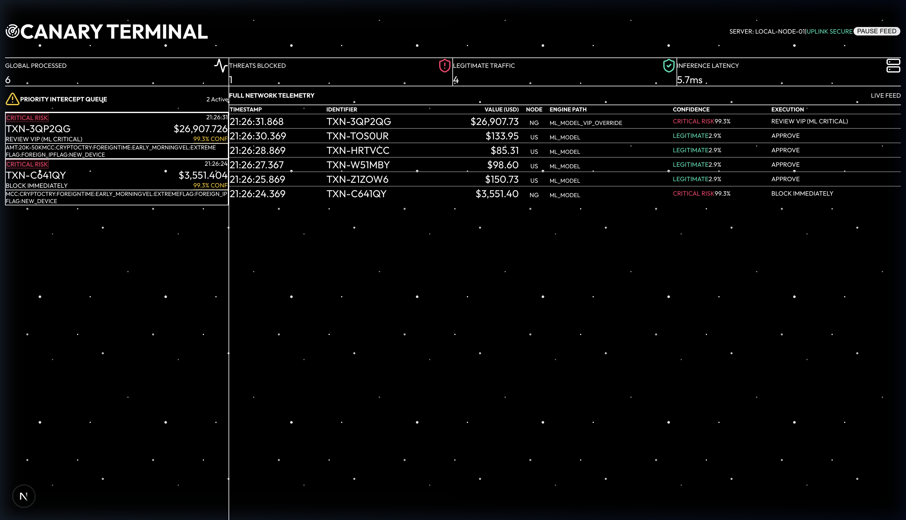

# 🐦 CANARY Enterprise Banking Suite
### Contextual Anomaly Network for Anomaly Recognition & analYsis

> *Like a canary in a coal mine — a high-performance Financial AI Suite that detects fraud and money laundering before it impacts the bottom line.*

[](https://github.com/restlessankyyy/canary-slm/actions/workflows/ci.yml)
[](https://www.python.org/)
[](https://pytorch.org/)
[](https://nextjs.org/)
[](https://fastapi.tiangolo.com/)

---

## 🏗️ Minimum Viable Product (MVP) Architecture

CANARY is not just an ML model—it is a full-stack, end-to-end **Enterprise Banking Suite** designed to process live transaction streams. The suite operates on a 4-layer architecture:

1. **API Gateway (FastAPI)**: A high-throughput Python API (`api/main.py`) exposing asynchronous endpoints (`POST /v1/score/fraud` and `POST /v1/score/aml`) for ingestion by downstream core banking systems.
2. **Business Rules Engine**: A deterministic layer (`api/rules.py`) that executes in microseconds *before* ML inference. It manages OFAC sanctions, VIP allow-lists, and hard velocity limits to prevent unnecessary compute and ensure compliance.
3. **Machine Learning Core**: A ~600K parameter PyTorch Transformer model trained specifically on sequence tabular financial data for both Single-Transaction Fraud and Multi-Sequence Anti-Money Laundering (AML).
4. **Operations Dashboard (Next.js)**: A standalone, functional Analyst Terminal (`dashboard/`) built with React and TailwindCSS. It provides an expert-level UX with a Priority Intercept Queue for human review and a full Live Telemetry feed.



---

## ⚙️ Ways of Working: The Live Data Flow

When a transaction hits the CANARY API Gateway, it flows through the following pipeline:

1. **Ingestion**: Transaction JSON is parsed and validated by Pydantic.
2. **Deterministic Rules Evaluation**: The `Business Rules Engine` inspects the transaction. If the country is embargoed (e.g., KP) or the user is on a VIP Allow-list, the system makes an immediate routing decision and bypasses the AI.
3. **Feature Tokenization**: If no rules are triggered, the transaction attributes (Amount, Time, Geo, Merchant Category, Device Flags) are discretized and mapped into a custom 512-token financial vocabulary.
4. **Transformer Inference**: The `[CLS]` token from the tokenized sequence is fed through 4 Transformer encoder layers to predict a continuous risk probability.
5. **Action Generation**: The system synthesizes the final rules decision with the ML confidence score, assigns a Risk Label (`LEGITIMATE`, `REVIEW`, `CRITICAL RISK`), extracts human-readable Explanations (`[FOREIGN_IP]`, `[EXTREME_VELOCITY]`), and returns the payload to the dashboard.

---

## 🚀 Quick Start (Enterprise Suite via Docker)

The easiest way to run the full MVP (API + Next.js Dashboard) is via Docker Compose.

```bash
git clone https://github.com/restlessankyyy/canary-slm
cd canary-slm

# Spin up the FastAPI Backend and Next.js Analyst Terminal
docker-compose up --build
```
* **Dashboard (UI)**: [http://localhost:3000](http://localhost:3000)
* **API Swagger Docs**: [http://localhost:8000/docs](http://localhost:8000/docs)

---

## 🧠 ML Architecture: The CANARY Core

```
Tokenized Transaction (max 64 tokens)
        │
        ▼
Token Embedding (vocab=512) + Learned Positional Encoding
        │
        ▼
 ┌──────────────────────────────────┐
 │  TransformerEncoder × 4 layers  │
 │  d_model=128 │ heads=4 │ FFN=256│
 │  Pre-LayerNorm │ GELU │ Dropout │
 └──────────────────────────────────┘
        │
      [CLS] pool
        │
        ▼
 Dense(128→64) → GELU → Dense(64→2)
        │
        ▼
   P(fraud) [0–1]
```

**Total Parameters: ~612K** (Extremely lightweight for millisecond-latency inference).

### Training Data Setup (Local Development)

If you wish to train the models locally outside of Docker:
```bash
pip install -r requirements.txt

# 1. Train Synthetic Fraud Model
python train.py --epochs 20

# 2. Train Real-World Kaggle Fraud Model (284k transactions)
python download_kaggle_data.py
python setup_kaggle.py --csv data/creditcard.csv
python train_kaggle.py --epochs 20

# 3. Train Anti-Money Laundering (AML) Model
python aml/train_aml.py --epochs 20
```

---

## ⚗️ Threat Vectors Detected

### 1. Single-Transaction Fraud Profiles
* **Card Testing**: Micro amounts (<$1), rapid succession, new device.
* **Account Takeover**: Large transfers, foreign country, late night.
* **CNP Fraud**: Online, billing mismatch, foreign IP.
* **Money Mule**: Crypto/wire transfers, extreme velocity, Tor/VPN.

### 2. Multi-Sequence AML Schemes (Account-level scoring)
The `aml/` module trains on sequences of 30 transactions per account to find hidden temporal behaviors:
* **Structuring**: Repeated deposits strictly between $8k–$9.9k (evading $10k SAR limits).
* **Layering**: Rapid `IN` → `OUT` → `IN` chains across multiple countries.
* **Smurfing**: One large incoming deposit split into many small outgoing transfers.
* **Dormant burst**: Account quiet for months, then experiences a sudden burst of high-value activity.
* **Round-tripping**: Funds exported and returned via overlapping nested routes within days.

---

## 🔌 API Gateway Consumption Example

Downstream systems can consume the scoring API in real-time:

```bash
curl -X 'POST' \
  'http://localhost:8000/v1/score/fraud' \
  -H 'Content-Type: application/json' \
  -d '{
  "transaction_id": "txn_8rjf92",
  "customer_id": "CUST_99342",
  "amount": 25000.0,
  "merchant_cat": "CRYPTO",
  "country": "NG",
  "is_domestic": false,
  "hour": 3,
  "day_of_week": 6,
  "channel": "ONLINE",
  "currency": "USD",
  "velocity": "EXTREME",
  "flags": ["NEW_DEVICE", "TOR_VPN", "FOREIGN_IP"]
}'
```

**Response Payload:**
```json
{
  "transaction_id": "txn_8rjf92",
  "fraud_probability": 0.9841,
  "risk_label": "🚨 CRITICAL RISK",
  "action": "Block immediately",
  "decision_source": "ML_MODEL",
  "risk_factors": [
    "AMT:20K-50K",
    "MCC:CRYPTO",
    "CTRY:FOREIGN",
    "TIME:EARLY_MORNING",
    "VEL:EXTREME",
    "FLAG:NEW_DEVICE",
    "FLAG:TOR_VPN",
    "FLAG:FOREIGN_IP"
  ],
  "processing_time_ms": 6.2
}
```

---

## 📂 Project Repository Structure

```
canary-slm/
├── api/                       # Enterprise Gateway
│   ├── main.py                # FastAPI endpoints
│   └── rules.py               # Deterministic Business Rules Engine
├── dashboard/                 # Next.js Analyst Operations Terminal
│   ├── src/app/page.tsx       # Live Telemetry UI
│   └── Dockerfile             # Standalone Next.js build
├── data/                      # Data engineering pipeline
│   ├── tokenizer.py           # 512-token financial domain vocabulary
│   ├── generate_synthetic.py  # 5-profile fraud data generator
│   └── dataset.py             # PyTorch Dataset + WeightedRandomSampler
├── aml/                       # Anti-Money Laundering Module
│   ├── aml_dataset.py         # 151-token account sequence encoder
│   └── aml_inference.py       # Sequence-level ML detection API
├── model.py                   # CANARY Transformer Encoder
├── config.py                  # Model & training config
├── train.py                   # Training loop (synthetic data)
├── Dockerfile.api             # FastAPI Dockerfile
├── docker-compose.yml         # Full suite orchestrator
└── .github/workflows/         # CI/CD (Linting + Model Training)
```

---

## 📝 License

MIT
